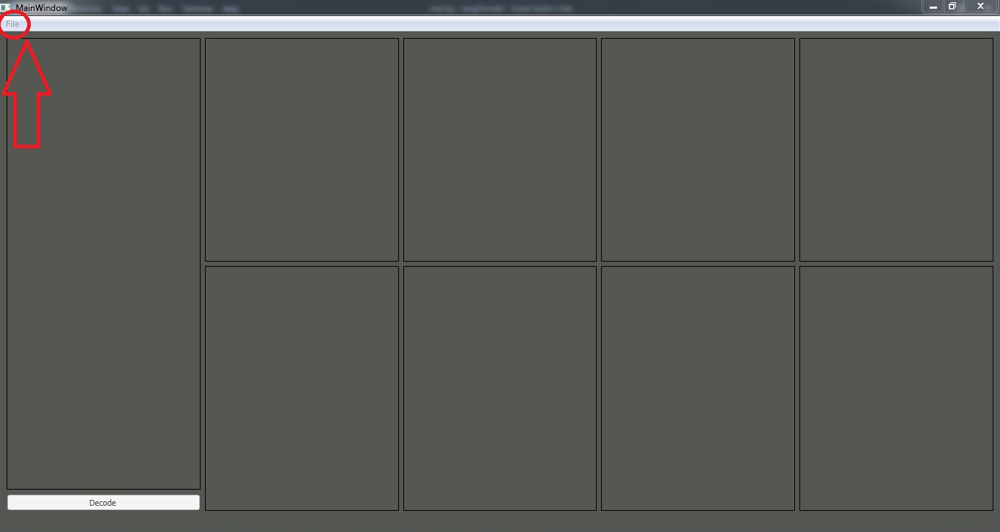
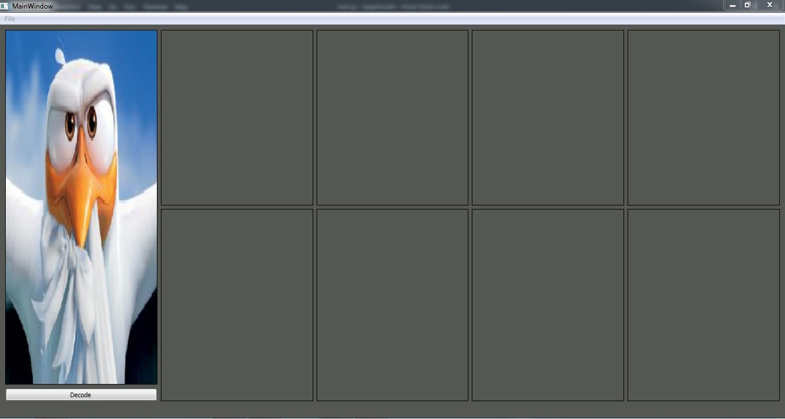
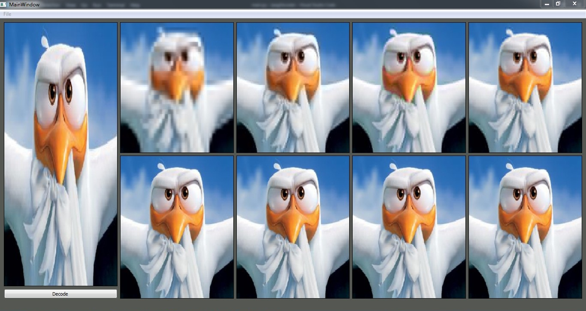

# **Image Decoder**
---
* ### First, the user must open a **progressive JPEG** from "file-->open" as shown :

* ### The photo will apper in the **biggest label** as the following figure :

* ### As the user opens the JPEG, the **Decoding** push button under the photo is enabled. Then, the user can simply click on it to see the phases which the image passes throw until it can be showed by its full data.

* ### we can notice the big difference between the first JPEG and last JPEG

## **FIRST OUTPUT**

---
## **LAST OUTPUT**

